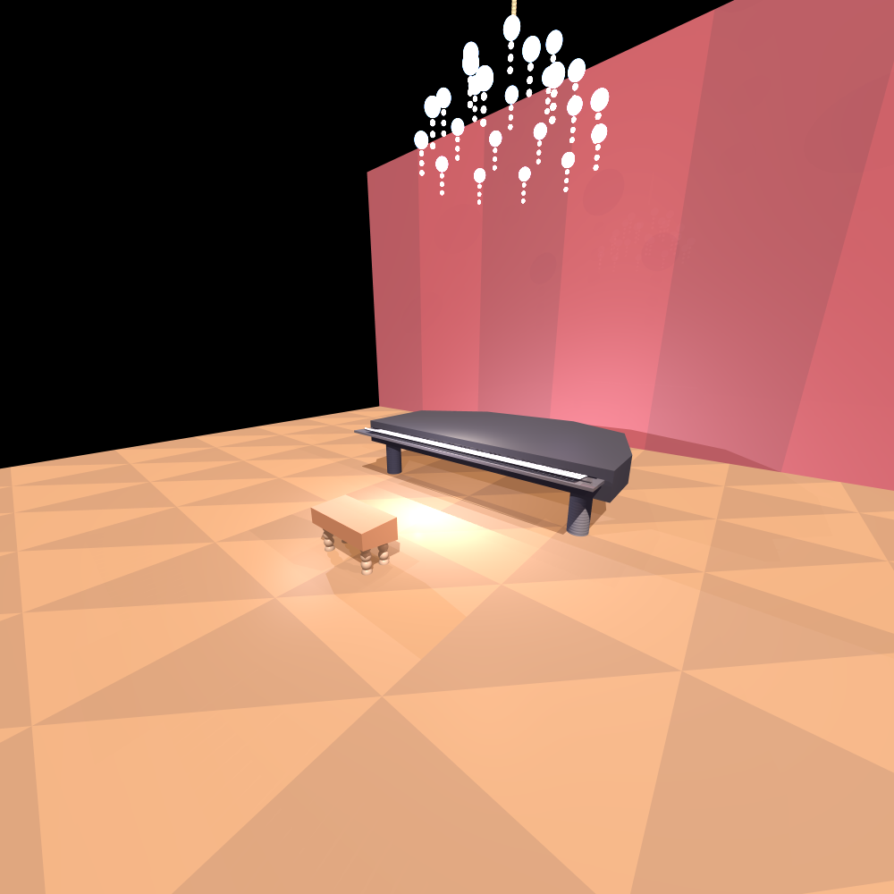

---

```markdown
# 🎨 Java Ray Tracing Renderer – Mini Project in Software Engineering



## Overview
This project is a **Ray Tracing Rendering Engine** developed as part of the **"Mini Project in Introduction to Software Engineering"** course.

The goal was to implement a modular, object-oriented rendering engine in **Java**, capable of producing realistic 3D images from scratch, while applying Software Engineering practices such as XP, TDD, and Refactoring.

The project emphasized iterative development, pair programming, and continuous refactoring cycles as part of the course methodology.

## Features
- Ray Casting & Ray Tracing engine
- Anti-Aliasing Techniques:
  - GRID Super Sampling
  - Adaptive Sampling
  - Jittered Sampling
- Depth of Field (DOF) Simulation
- Multi-threaded Rendering for performance
- Pixel Manager for progress tracking and debugging
- Modular design with clear separation of concerns:
  - Camera
  - RayTracer (SimpleRayTracer, RayTracerBase)
  - Scene & SceneBuilderXML
  - Geometries (Sphere, Plane, Cylinder, Triangle, etc.)
  - Lighting (AmbientLight, PointLight, DirectionalLight, SpotLight)
  - Primitives (Point, Vector, Ray, Material, Color, etc.)

## Project Structure
```

├── geometries/
│   ├── Cylinder, Plane, Sphere, Tube, Polygon, Triangle, etc.
├── lighting/
│   ├── AmbientLight, DirectionalLight, PointLight, SpotLight, etc.
├── primitives/
│   ├── Color, Material, Point, Ray, Vector, etc.
├── renderer/
│   ├── Camera, SimpleRayTracer, PixelManager, ImageWriter, etc.
├── scene/
│   ├── Scene, SceneBuilderXML
├── unittests/
│   ├── geometries/, primitives/, renderer/
│   ├── Comprehensive test coverage for all modules
├── images/
│   ├── (Rendered images will go here)
└── README.md

```

## Example Render
### Grand Piano on Stage


(All renders were generated using our ray tracing engine)

## How to Run
1. Clone the repository.
2. Open the project in IntelliJ or Eclipse.
3. Run the test files in `unittests/` to render scenes.
4. The resulting images will be saved in the `images/` folder.

## Technologies & Tools
- Java
- Object-Oriented Design
- Design Patterns (Builder, Strategy, etc.)
- TDD & Refactoring
- Multithreading

## Key Learnings
- How to build a rendering engine from scratch.
- Designing and implementing a modular software system.
- Applying software engineering best practices to a complex project.
- Overcoming graphical and performance challenges through algorithmic design.
```

---

